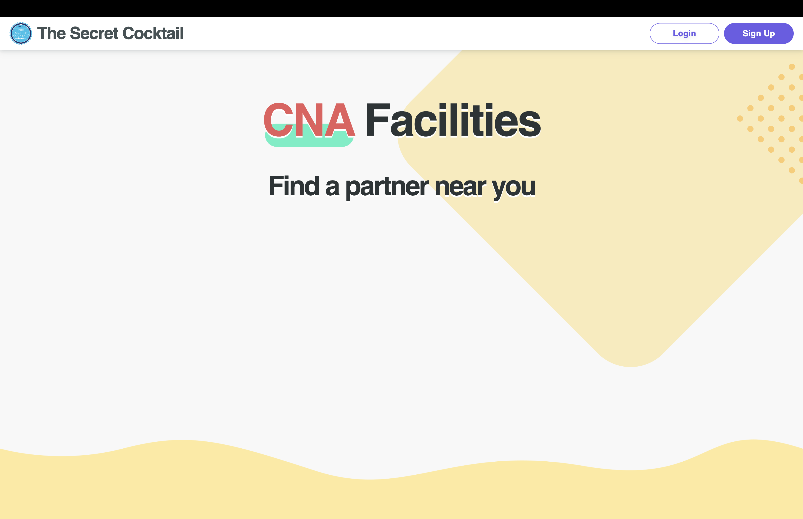
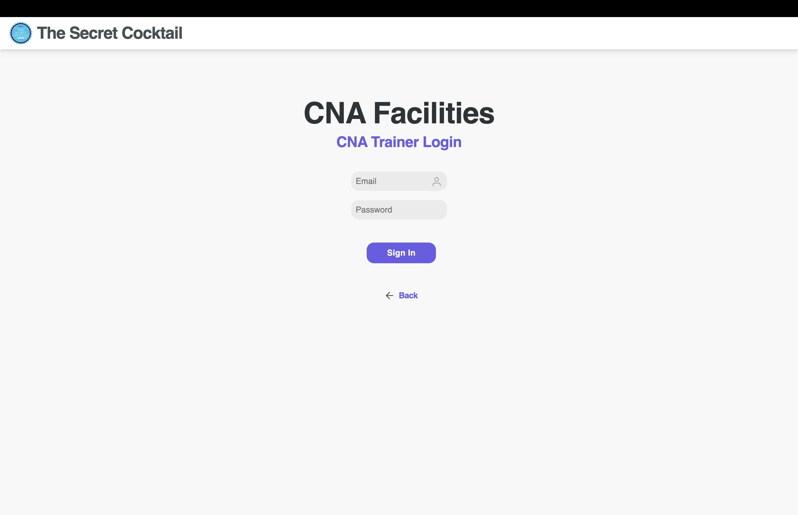
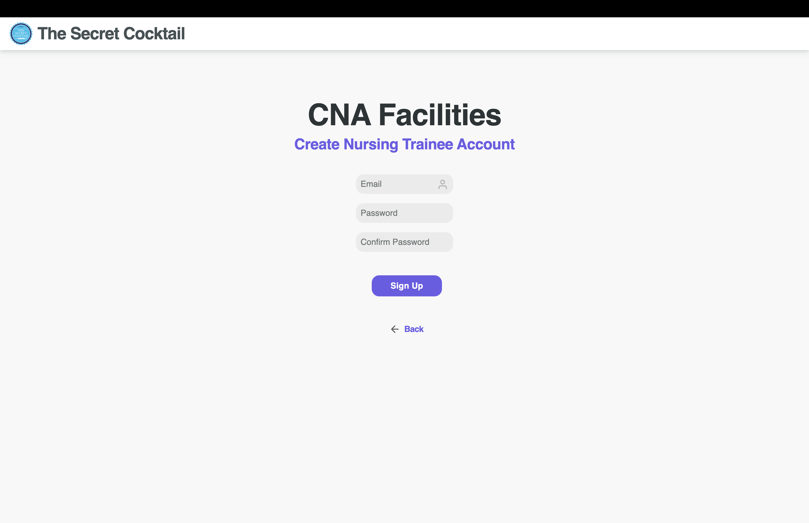
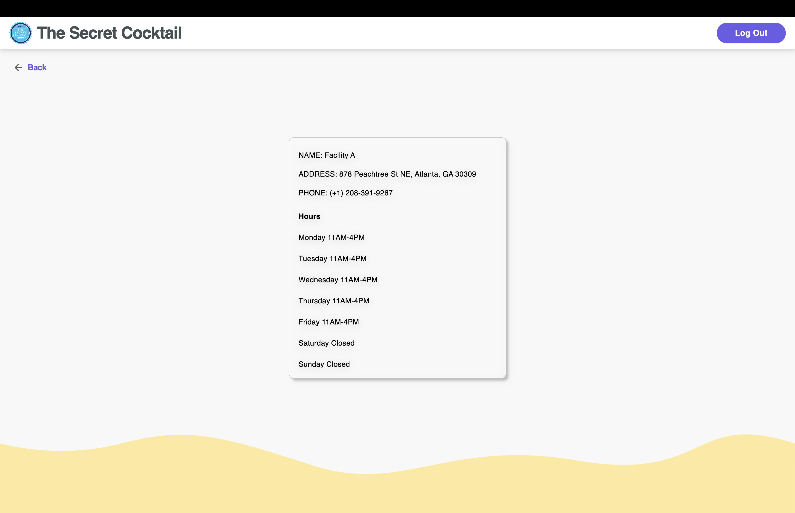
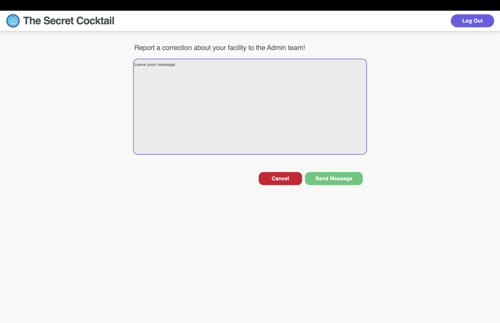
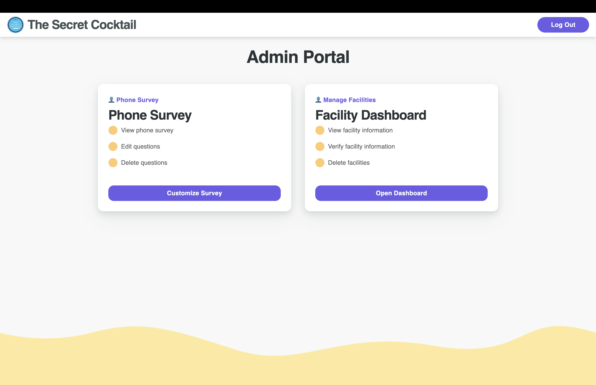
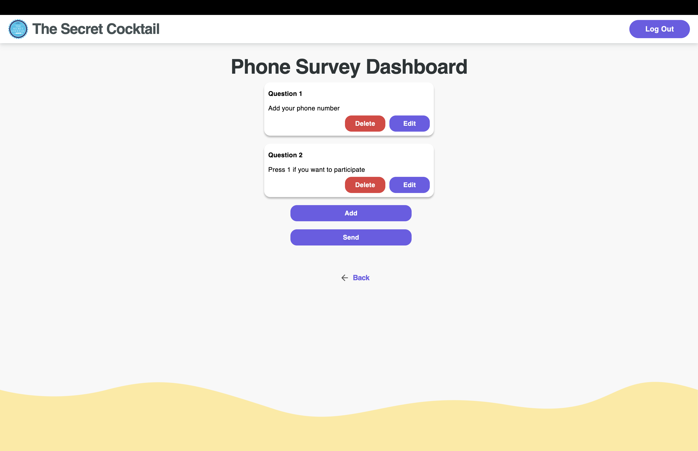

# web app

[https://secret-cocktail.web.app](https://secret-cocktail.web.app)

## Available Scripts

In the project directory, you can run:

### `yarn start`

Runs the app in the development mode.\
Open [http://localhost:3000](http://localhost:3000) to view it in the browser.

The page will reload if you make edits.\
You will also see any lint errors in the console.

## Optional Environment Variables

```shell
API_URL="..."
REACT_APP_GOOGLE_MAPS_API_KEY="..."
REACT_APP_GOOGLE_GEOCODING_API_KEY="..."
```

## Screenshots















